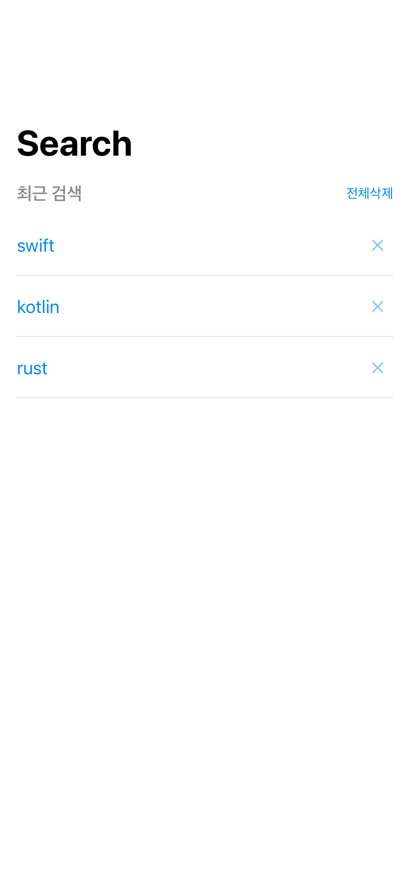
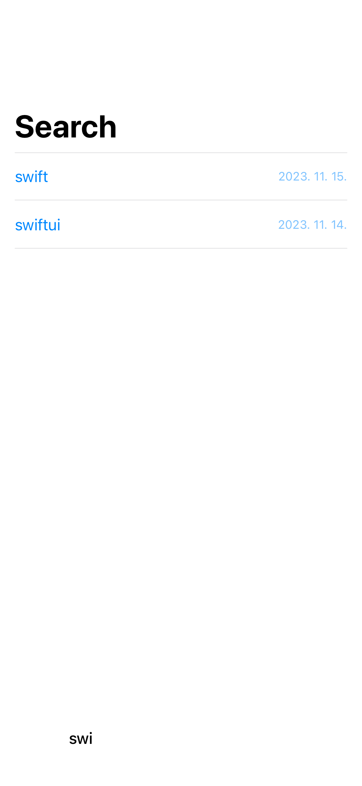
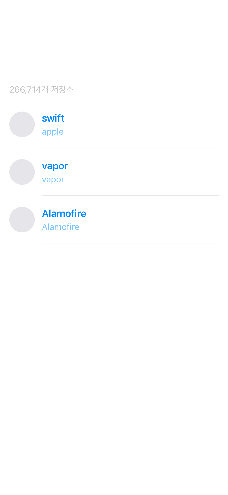
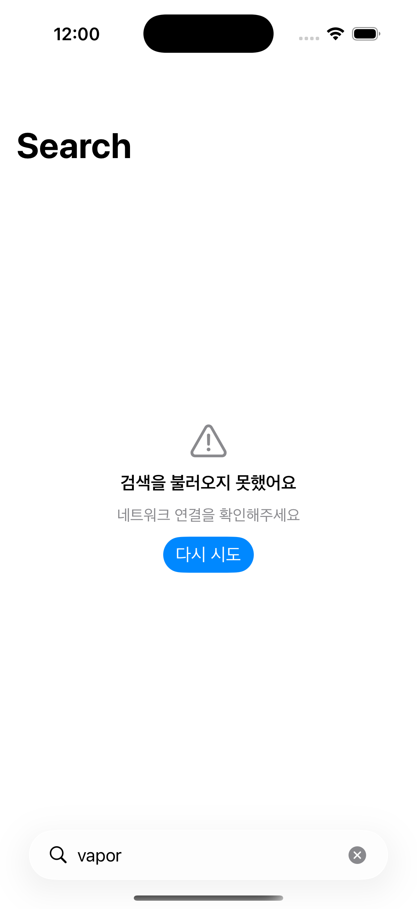

# Kurly GitHub Search

[](https://github.com/CodeChallengesHub/kurly2026/actions/workflows/test.yml)
[](https://github.com/CodeChallengesHub/kurly2026/actions/workflows/lint.yml)

컬리 iOS 직무 1차 직무적합성 사전과제 — GitHub 저장소 검색 iOS 앱.
**SwiftUI + Modular Clean Architecture + microfeatures 5-target**으로 구현했으며, 프로덕션 외부 라이브러리는 0개입니다.

## 스크린샷

| 최근 검색 | 자동완성 | 검색 결과 | 에러 + 재시도 |
|---|---|---|---|
|  |  |  |  |

> 스크린샷은 `swift-snapshot-testing`으로 자동 생성된 reference PNG. CI에서 회귀 검증.

## 핵심 기능

- **검색**: `.searchable` + 키보드 submit → 같은 화면에서 `.results` state로 전환 (large title은 그대로 유지)
- **자동완성**: 최근 검색어 prefix 매칭, `Clock` 주입 + 300ms debounce (테스트는 `TestClock`으로 결정론적)
- **최근 검색**: 개별 삭제 / 전체 삭제(확인 Alert), UserDefaults + JSON 영속화
- **검색 결과**: 총 개수 헤더 + List + 원형 avatar 썸네일(`CachedAsyncImage` + NSCache)
- **무한 스크롤**: 셀 `.onAppear` 트리거, 페이지 누적, ID 기반 dedup, 하단 ProgressView/재시도
- **에러 처리**: rate limit / transport / decoding 별 메시지 + 다시 시도 버튼
- **WebView**: `WKWebView` wrap, KVO로 estimatedProgress 추적해 상단 ProgressView 표시

## 아키텍처

**Modular + Clean Architecture (Vertical Slicing)** — Feature 단위로 모듈 분리, 각 모듈은 **microfeatures 5-target** 패턴.

```
App                                      ← Composition Root
 ├── AppRouter (Destination enum)
 ├── AppDIContainer
 └── AppRootView (NavigationStack)
        │
        ▼
Feature/Search                           Feature/WebView
 ├── Interface (Entity, Protocol, Destination)
 ├── Source (View, ViewModel, Repo Impl, UseCase Impl)
 ├── Testing (Mock, Stub)
 └── Tests (Domain, Data, Presentation, Snapshot)
        │
        ▼
Core/Network         Core/Storage        Core/ImageLoading
 ├── Interface (Protocol, Entity)
 ├── Source (URLSession / UserDefaults / NSCache)
 ├── Testing (URLProtocolStub / InMemoryStorage / MockImageLoader)
 └── Tests
```

### microfeatures 5-target 패턴

| Sub-target | 역할 |
|---|---|
| `Interface` | 외부에 노출할 protocol, Entity, Destination |
| `Source` | 실제 구현 (View, ViewModel, Repository) |
| `Testing` | Mock, Stub (다른 모듈 Tests에서 import) |
| `Tests` | 단위/스냅샷 테스트 |

**효과**: 다른 모듈은 `XxxInterface`에만 의존 → `Source` 변경 시 재컴파일 차단. Mock은 `Testing` target에 격리되어 의존성 사이클 자동 차단.

자세한 모듈 구조와 의존성 규칙은 [docs/architecture.md](docs/architecture.md) 참고.

## 기술 스택

| 항목 | 결정 |
|---|---|
| UI 프레임워크 | **SwiftUI** + `@Observable` + `NavigationStack` |
| 비동기 | **async / await + Task**. debounce는 `Clock` 주입 + `clock.sleep(for:)` |
| 동시성 | actor (Repository, UseCase Mock) + `@MainActor` (ViewModel) |
| 의존성 주입 | 생성자 주입 + `AppDIContainer` 수동 조립 (singleton 금지) |
| 화면 전환 | Router 패턴 + Feature Interface의 Destination struct |
| WebView | `UIViewRepresentable`로 `WKWebView` wrap |
| 최근 검색 저장 | UserDefaults + Codable (`[RecentKeyword]` JSON 단일 키) |
| 프로젝트 도구 | **SwiftPM only** (Tuist 미사용) |
| 외부 라이브러리 (프로덕션) | **0개** |
| 외부 라이브러리 (테스트) | `swift-snapshot-testing` (SwiftUI View Snapshot) |
| Lint | `SwiftLint` (CI `--strict`) |
| CI | GitHub Actions (Test + Lint), Gemini PR 자동 리뷰 (별도 관리) |
| 최소 지원 버전 | **iOS 17.0+** (Modules 패키지는 macOS 14.0+로 `swift test` 호환) |

스택 채택 근거와 trade-off는 [docs/plan.md](docs/plan.md) 참고.

## 실행

iOS 17+ 시뮬레이터에서 바로 실행 가능합니다. GitHub API 인증 토큰 불필요.

```bash
# 1) Xcode로 열기
open App/KurlyGitHubSearchApp.xcodeproj
# Build & Run (⌘R) — iPhone 17 시뮬레이터 권장

# 2) 또는 CLI로 빌드
xcodebuild build \
  -project App/KurlyGitHubSearchApp.xcodeproj \
  -scheme KurlyGitHubSearchApp \
  -destination 'platform=iOS Simulator,name=iPhone 17,OS=latest'
```

> GitHub Search API는 무인증 시 **10 req/min, 60 req/h** 제한. 시연 중 rate limit이 잡히면 에러 UI + "다시 시도" 버튼이 노출됩니다.

## 테스트

| 잡 | 명령 | 검증 범위 |
|---|---|---|
| SwiftPM (macOS) | `cd Modules && swift test --parallel` | Domain, Data, ViewModel (UIKit 비의존) |
| Xcode iOS | `cd Modules && xcodebuild test -scheme Modules-Package -destination 'platform=iOS Simulator,name=iPhone 17,OS=latest' -only-testing:ImageLoadingTests -only-testing:SearchTests/SearchViewSnapshotTests -only-testing:SearchTests/SearchResultViewSnapshotTests` | ImageLoading + SwiftUI 스냅샷 (iOS only) |
| Lint | `swiftlint --strict` | 코드 스타일 |

테스트 작성 가이드는 [docs/testing.md](docs/testing.md) 참고.

### 결정론적 디바운스 테스트

`SearchViewModel`이 `Clock` 프로토콜에 의존하므로, 테스트에서는 직접 구현한 `TestClock`(외부 라이브러리 0 정책)으로 시간 흐름을 제어합니다. 300ms 경계가 결정론적으로 검증됩니다 — `SearchViewModelTests` 참고.

## 의사결정 문서

| 문서 | 내용 |
|---|---|
| [docs/plan.md](docs/plan.md) | 전체 설계 (스택 선택 근거, PR 분할, trade-off) |
| [docs/architecture.md](docs/architecture.md) | 모듈 구조, 의존성 규칙, microfeatures 패턴 |
| [docs/coding-style.md](docs/coding-style.md) | 명명, SwiftLint 룰, 코드 컨벤션 |
| [docs/testing.md](docs/testing.md) | 레이어별 테스트 매트릭스 + 패턴 |
| [docs/api.md](docs/api.md) | GitHub Search API 명세, 에러 매핑, rate limit |
| [docs/ai-usage.md](docs/ai-usage.md) | **AI 활용 내역** (Claude Code + Gemini Code Review) |

## AI 활용

본 프로젝트는 **계획 → 설계 → 구현 → 리뷰** 전 단계에서 생성형 AI를 적극 활용했습니다 ([상세](docs/ai-usage.md)):

- **Claude Code (Opus 4.7, 1M context)**: 계획서 작성, 구조 설계, 코드 작성, 사전 코드 리뷰(`/code-review`)
- **Gemini Code Review**: GitHub Actions로 PR 자동 리뷰 (별도 관리)

리뷰 흐름은 plan.md의 ["PR 리뷰 응답 체크리스트"](docs/plan.md#pr-리뷰-응답-체크리스트-gemini-자동-리뷰--직접-코멘트) 참조. 각 PR마다 `@gemini-code-assist` 답글 + 커밋 SHA + diff 블록 형식으로 응답 기록을 남겼습니다.

## 라이센스

본 레포는 채용 사전과제 제출 목적입니다.
